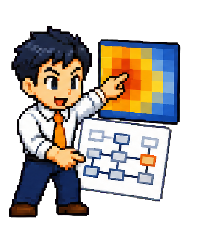

# JOB 03｜行動・ヒートマップ分析



Microsoft Clarityのクリック・スクロール画像とページキャプチャから、利用者の行動上の摩擦を探すAIです。ヒートマップだけで心理を断定せず、画面構造とGA4の変化を組み合わせます。

## このJOBが行うこと

- Clarity連番キャプチャの結合
- PC/SPページの再現可能なキャプチャ
- クリック集中、無反応クリック、到達不足、導線競合の記録
- 証拠画像と所見の台帳化

## 入力

- PC/SP × クリック/スクロールのClarity画像
- 対象ページURLまたは全画面キャプチャ
- 対象期間、デバイス、サンプル数

## 出力

- 証拠画像一覧
- 行動所見と反証候補
- JOB 05へ渡す `findings.json`

## セットアップ

```bash
python -m pip install -r requirements.txt
python scripts/concat_captures.py input/clarity --out output/clarity_joined.png
python scripts/web_capture_segments.py --url https://example.com --name output/page
```

CLI AIへの最初の依頼例:

> JOB 03として、inputのPC/SPヒートマップを分析してください。観測事実と心理仮説を分け、各所見に証拠画像名と追加確認方法を付けてください。

[7人の一覧へ戻る](../../README.md)
